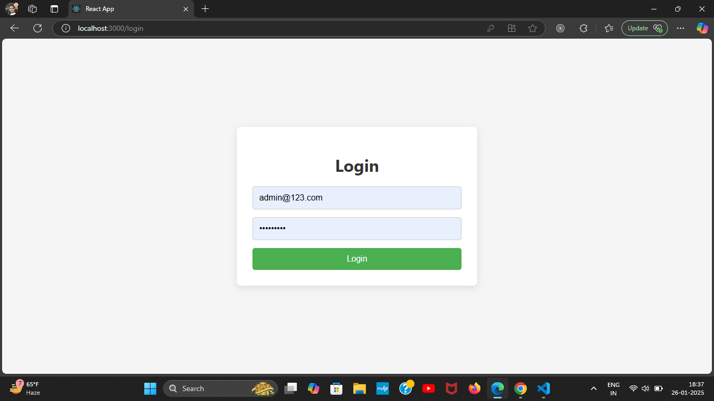
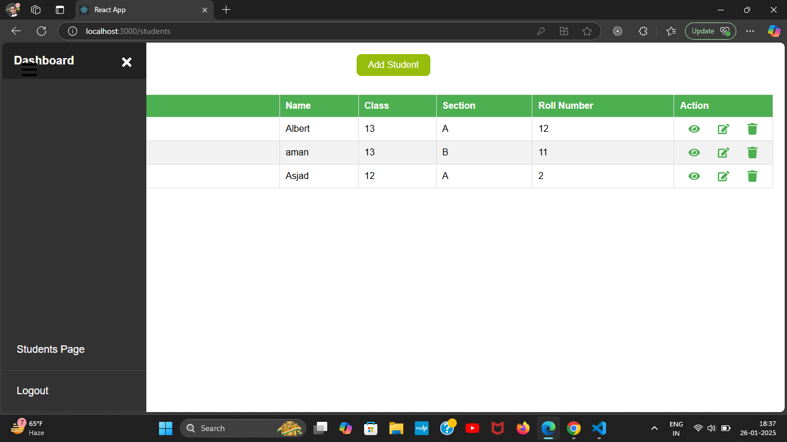
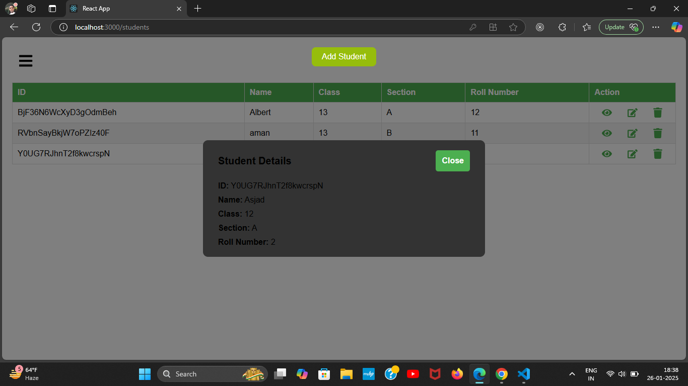

# React Firebase Students Management App

This project is a Students Management App built using React.js and Firebase, which allows users to manage a list of students. The application includes functionalities like adding, viewing, editing, and deleting student data. It features Firebase Authentication for secure login and Firestore for real-time database operations.

## Features

1. User Authentication

Login using Firebase Authentication.

Pre-configured admin credentials for testing:

Username: admin@123.com

Password: admin@123

2. Student Management
Add Student: Add a new student to the database using a modal form.
View Details: View a student's complete details in a modal.
Edit Student: Modify existing student details.
Delete Student: Remove a student from the database with confirmation.

3. Navigation and Sidebar

A responsive sidebar for navigating between pages and logging out.
A hamburger menu for toggling the sidebar on smaller screens.

4. Real-Time Database
Integrated with Firebase Firestore for storing and fetching student data.

5. Responsiveness

Fully responsive design, compatible with desktops, tablets, and mobile devices.

## Tech Stack

## Frontend
React.js

CSS

Backend

Firebase Authentication

Firebase Firestore

## Project Structure

├── public/
├── src/
│   ├── components/
│   │   ├── Sidebar.js
│   │   ├── AddStudentModal.js
│   ├── pages/
│   │   ├── LoginPage.js
│   │   ├── StudentsPage.js
│   ├── styles/
│   │   ├── StudentsPage.css
│   │   ├── Sidebar.css
│   ├── firebase-config.js
│   ├── App.js
│   ├── index.js
└── README.md

## Getting Started

Follow these instructions to set up the project on your local machine.

1. Clone the Repository

git clone https://github.com/ansarialiakbar/students-managment.git

cd your-repo-name

2. Install Dependencies

Make sure you have Node.js installed. Then, run:

npm install

## Configure Firebase

Go to the Firebase Console.

Create a new project and enable:

Authentication (Email/Password Sign-in method).

Firestore Database.
Replace the Firebase configuration in firebase-config.js with your project details:

import { initializeApp } from "firebase/app";

import { getFirestore } from "firebase/firestore";

import { getAuth } from "firebase/auth";

const firebaseConfig = {
  apiKey: "YOUR_API_KEY",

  authDomain: "YOUR_AUTH_DOMAIN",

  projectId: "YOUR_PROJECT_ID",

  storageBucket: "YOUR_STORAGE_BUCKET",

  messagingSenderId: "YOUR_MESSAGING_SENDER_ID",

  appId: "YOUR_APP_ID",
};

const app = initializeApp(firebaseConfig);

export const db = getFirestore(app);

export const auth = getAuth(app);

## Run the Project

Start the development server:

npm start

The app will run at http://localhost:3000.

## Deployment

You can deploy the app using services like Vercel, render or Netlify. Make sure to configure environment variables if required.

Deployed Link: https://students-managment.onrender.com/login

## Screenshots

1. **Login Page**
   The login page with Firebase Authentication.

   

2. **Students Page**
   The main page displaying a list of students and options to manage them.

   

3. **Add Student Modal**
   A modal for adding new students to the database.

   

## License

This project is licensed under the MIT License. See the LICENSE file for details.

## Contact

Ali Akbar

GitHub: @ansarialiakbar

Email: ansarialiakbar2001@gmail.com
